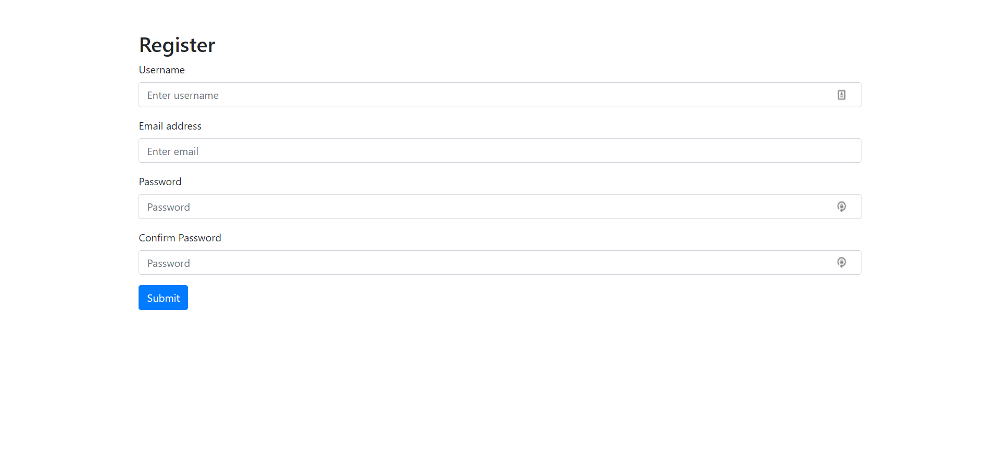

# Server-side validation with express-validator
Now that you have done some readings on validation, it's time to practice. In this activity, we will specifically utilize the [express-validator](https://express-validator.github.io/docs/) package to validate a registration form. The objectives of this assignment are:
1. Understanding how to use express-validator with express
2. Practicing different validation types
3. Practicing writing custom validations


## Setup
1. Open your terminal and navigate to your dedicated assignments folder.
2. Then clone this assignment repo on your local machine.
3. Now open the assignment folder on VSCode.

We already started the `app.js` file for you. It includes:
1. Initial setup for your Express server.
2. A GET request to `/` which renders the `index.ejs` file we included in your `views` folder.
3. A variable called `usedEmails` that will come into use for your validation rules.

**NOTE**: Please don't make any change to the `usedEmails` variable in the code.

Let’s test our app out! Start the app by running `npm start`. Now visit `http://localhost:3000` on the browser, you should be able to see this:



## Practice Time

Now that you have the starter code for this assignment, it's time to do some Googling and validate each user input in the registration form. We advise you to keep the [express-validator documentation](https://express-validator.github.io/docs/) open while working on this activity.

### Requirements
1. Create a POST request to the endpoint `/users` to handle user registration requests.
2. Connect the registration form to send the POST request with form data when submitted.
3. Validate all user inputs within the POST request.
4. Show alerts on the registration form in case of invalid inputs.
3. Save emails of successful registrations as used.

Your POST request body must in the format:
```js
{
    username: "string",
    email: "string",
    password: "string",
    confirmPassword: "string"
}
```

**HINT**: You can create all user input validations using a validation chain of the `check()` function provided by `express-validator`. In case the user request does not pass one or more validations, you will have to pass a variable to your EJS template and render specific alerts for the user. (We already know how to pass variables to EJS from the Meme Website activity).

#### Part 1: Validating the username
The username should pass the following validation rules:
1. Must be at least 4 characters long
2. Should not include spaces
3. Should not be empty

If a user request fails any of these validations, you will have to output specific alerts to inform the user. Your alert messages should be as follows:
1. 'Username must be at least 4 characters long'
2. 'Username should not include spaces'
3. 'Username should not be empty'

**NOTE**: You may use the [Bootstrap alert component](https://getbootstrap.com/docs/4.0/components/alerts/) to display validation alerts on the registration form.

#### Part 2: Validating the email
The email should pass the following requirements:
1. Should be unique (Here you will write a custom validation to check the `usedEmails` array)
2. Should be in valid email format
3. Should not be empty

If a user request fails any of these validations, you will have to output specific alerts to inform the user. Your alert messages should be as follows:
1. 'Email already exists'
2. 'Invalid email'
3. 'Email should not be empty'

#### Part 3: Validating the password
The password should pass the following requirements:
1. Must have at least 5 characters
2. Must contain at least 1 number, 1 uppercase and 1 lowercase
3. Should match with the confirm password input (Here you will use custom validation to compare the 2 password inputs)
4. Should not be empty

If a user request fails any of these validations, you will have to output specific alerts to inform the user. Your alert messages should be as follows:
1. 'Password must be at least 5 characters long'
2. 'Password must contain a number, uppercase and lowercase'
3. 'Passwords are not matching'
4. 'Password should not be empty'

#### Part 4: Sucessful validation!
Phew, once the user request has finally passed all our validation, it's time for us to save the registered email.
1. Using the request body, push the new email to our `usedEmails` array
2. Show a success alert to the user saying "Congratulations, your account has been successfully created!"

### Submission
Run `npm test` to test your code. If it shows all tests have passed then you're good to go.

Since this is a group assignment and you will be sharing the assignment repo with your group member, you can perform intermediate commits and pushes as required to share your code within your group.

Once you're ready to submit the assignment, follow these steps on your terminal:
1. Stage your changes to be committed: `git add .`
2. Commit your final changes: `git commit -m "solve assignment"`
3. Push your commit to the main branch of your assignment repo: `git push origin main`

After your changes are pushed, return to this assignment on Canvas for the final step of submission.

## Conclusion
Now you have learnt how to validate user inputs and handle different types of errors. Validation helps us ensure that any mistakes made by a user does not affect the functionality of our system. We always inform the user about the issue so that they can correct it. Can you think of other scenarios besides user registration form where validation will be helpful?

Make sure to check out another famous validation package called [Joi](https://dev.to/itnext/joi-awesome-code-validation-for-node-js-and-express-35pk).


---
## References
- https://express-validator.github.io/docs/check-api.html